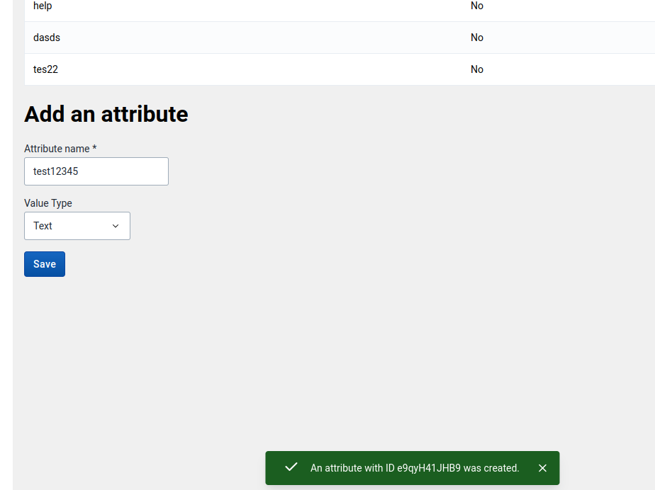
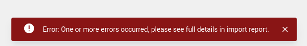
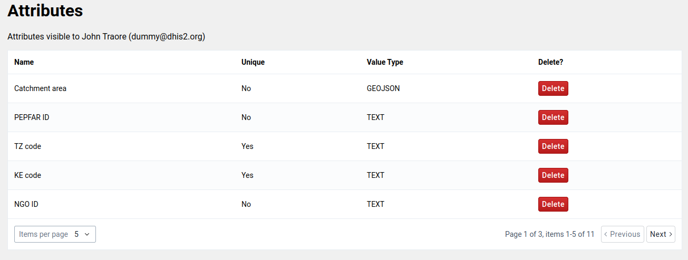

:::tip[What you will learn]
- [ ] An overview of the App Platform and App Runtime toolset
- [ ] The philoshopy behind AppRuntime hooks (imperative vs declarative)
- [ ] Use Alerts and Config service
- [ ] Use Data Service: Lookup specific APIs and convert the API requests into queries and mutations
- [ ] Test queries and mutations in the playground
- [ ] Use `useDataQuery` and `useDataMutation` hooks
- [ ] Other advanced use cases for the Data Service hooks (dynamic queries, refetching, lazy mode etc..)
:::

## Agenda
| Time | Topic | |
| --- | --- | --- |
| 09:00 - 10:30 | Opening Workshop | Overview and Basic Hooks (`useConfig` and `useAlert`) |
| 10:30 - 11:00 | _coffee break_ | |
| 11:00 - 12:30 | Workshop | App Runtime: API overview, Query Playground and Data Queries |
| 12:30 - 13:30 | _lunch break_ | |
| 13:30 - 15:00 | Workshop | App Runtime: Mutations |
| 15:00 - 15:30 | _coffee break_ | |
| 15:30 - 16:30 | Workshop | App Runtime: Advanced Data Queries |
| 16:30 - 16:45 | Closing | |
| 16:45 - 17:00 | Q&A (with French support) | |

## Presentation

> _**instructor note**: We will go through the presentation in four parts: the AppRuntime overview and basic hooks, data queries, data mutations, advanced data queries._

<iframe src="https://docs.google.com/presentation/d/e/2PACX-1vSdtSEOUIBoql2XTrjEQPndvb6BAjnqcGiqhk841tZRivnTMNpn0PSFUEMElj1TK83hNsgGe811Qgjw/embed?start=false&loop=false&delayms=3000" frameborder="0" width="100%" height="569" allowfullscreen="true" mozallowfullscreen="true" webkitallowfullscreen="true"></iframe>


## Overview and Basic hooks


### Task 1.1 - useConfig
:::info[Requirement]
Get the DHIS2 configuration using [useConfig hook](https://developers.dhis2.org/docs/app-runtime/hooks/useConfig) and show the API version on the home page similar to the screenshot below (look up the correct UI component).

- **Hint**: Lookup the correct UI component in the [documentation](https://ui.dhis2.nu/), and don't forget about internationalisation (if you've set it up in the previous day)
::: 

#### The expected result


### Task 1.2 - useAlert
:::info[Requirement]
Replace the alert in the `Form` view with an [alert from the UI library](https://ui.dhis2.nu/components/alertbar). You _should_ use the [useAlert](https://developers.dhis2.org/docs/app-runtime/hooks/useAlert) hook which wraps the UI component and makes it easier to a DHIS2 application.
::: 

#### The expected result
You should display a **success** message with the stringified values of the form (similar to what the _alert_ used to show previously).


You should also handle the **error** state. For this exercise, you can simulate an error in the code.


## Data Queries

> _**instructor note**:  Overview of the API and how to convert an API request to a query, and demonstrate the [Query playground](https://runtime.dhis2.nu/playground/)._

### Task 2.1 - Get list of Attributes (useDataQuery)

:::info[Requirement]
Replace the _hardcoded_ list of attributes with the list of attributes from the API. For the API call, we want to:
- only display 5 attributes per page
- order by `displayName` in descending order
:::

#### The expected result
The expected result should not look much different except that it's in the reverse order and displaying a smaller number of attributes. The result should be coming from the API rather than the hardcoded list.


### Task 2.2 - Get user info (parallel queries)


:::info[Requirement]
Add a query to get the current logged in user info, and show their name and email. 
:::

#### The expected result
On top of the table, show the current user `displayName` and `email`. This information can be retrieved from calling `api/me` endpoint (but you should use the same data query for attributes for this exercise).


## Mutations

> _**instructor note**:  Show examples of create, update, and delete mutations in the [Query playground](https://runtime.dhis2.nu/playground/)._


### Task 3.1 - Create Attribute (useDataMutation)

:::info[Requirements]
- Under the attributes table, add a form to create a new attribute.
- Show an Alert when the form is updated successfully.
- Show an error message when the form submission errors (for example, if the attribute name is not unique)

The list of Attributes is not automatically updated after a new Attribute is created, ignore that for now. We will work on automatically refreshing the list in the next section.

**Tip:**: change the order of the Attributes in the table to be sorted by `order: 'created:desc'` in order to see the newly created attributes at the top of the table.
:::

:::info[Bonus Requirement]
In the case of errors, we're just showing the general error message returned from the API. Inspect the response, and you will see that the error details exist in the returned object. As a bonus, update the error displayed to get all the list of errors and display them in the Alert.
:::

#### The expected result
You should create the form under the attributes list. Hardcode the list of Value Types to `TEXT` and `NUMBER`. On submit, if the creation succeeds show the success Alert below (with the ID of the created Attribute)



Here is the code for the `Create Attribute form` to get you started quickly. Add it to your project, and reference the component to display under the Attributes table (`src/views/Attributes.js`)

```jsx title="/src/views/AttributeCreateForm.js" 
import i18n from '@dhis2/d2-i18n'
import {
    Button,
    InputFieldFF,
    hasValue,
    ReactFinalForm,
    SingleSelectFieldFF,
} from '@dhis2/ui'
import React from 'react'
import styles from './Form.module.css'

const { Field, Form: RFForm } = ReactFinalForm

const AttributeCreateForm = () => {
    const onSubmit = async (values) => {
        // @todo: add the mutation
    }

    return (
        <div>
            <h1>{i18n.t('Add an attribute')}</h1>

            <RFForm onSubmit={onSubmit}>
                {({ handleSubmit }) => (
                    <form onSubmit={handleSubmit}>
                        <div className={styles.row}>
                            <Field
                                required
                                name="name"
                                label={i18n.t('Attribute name')}
                                component={InputFieldFF}
                                validate={hasValue}
                            />
                        </div>
                        <div className={styles.row}>
                            <Field
                                name="valueType"
                                label={i18n.t('Value Type')}
                                component={SingleSelectFieldFF}
                                className={styles.title}
                                initialValue="TEXT"
                                options={[
                                    {
                                        label: i18n.t('Text'),
                                        value: 'TEXT',
                                    },
                                    {
                                        label: i18n.t('Number'),
                                        value: 'NUMBER',
                                    },
                                ]}
                            />
                        </div>

                        <div className={styles.row}>
                            <Button type="submit" primary>
                                {i18n.t('Save')}
                            </Button>
                        </div>
                    </form>
                )}
            </RFForm>
        </div>
    )
}

export default AttributeCreateForm

```

If the submission fails, for example, in the case of a duplicate name, then show an error message with the error received.




### Task 3.2 - Delete Attribute (and refresh)

:::info[Requirement]
- Add a delete button in the tables' rows to delete an entity using a Delete mutation.
```jsx title="example delete button"
<Button small destructive disabled={loading} onClick={onClick}>Delete</Button>
```
- **Refresh** the list of Attributes after an item is deleted successfuly.

**Tip:** Check out the [Data Mutation tutotial](https://developers.dhis2.org/docs/tutorials/app-runtime-mutation) from our documentation for an example of how to implement a `Delete` mutation.
:::

#### The expected result


## Advanced use cases

> _**instructor note**:  Live code the advanced query options._

### Task 4.1 - Pagination
:::info[Requirements]
- Implement ability to go through the pages of the Attributes list.
- Implement ability to change the page size.
- **Tip**: Look at the [Pagination](https://ui.dhis2.nu/components/pagination/) component (and the demo link at the end).
:::

#### The expected result
A paginator should be added to the bottom of the table and its initial values should reflect the number _attributes_ returned by the API. It should respond to any change to the _page size_ or _page number_ and show the correct data.




### Task 4.2 - Show Attribute details
:::info[Requirements]
- When the user clicks on a row, show the rest of the details of the attribute.
- You can just dump the JSON returned for now (or design in a nice UI if you prefer).
:::

### Task 4.3 - (Bonus) Update Attribute

:::info[Requirement]
This application supports **creating** and **deleting** attributes, but it doesn't support **renaming** them.  This is your task:

Add an `Rename` button to each row in `Attributes.js`.  This Edit button should open a `Dialog` component (from `@dhis2/ui`) which contains a form.  That form should allow the user to type a new name for the selected Attribute.  When submitted, the form should use a Data Mutation to send a POST request updating the visualization's name.  The dialog should then disappear and the table of visualizations should refresh to show the updated name.
:::

## Resources

- [REST API Documentation](https://docs.dhis2.org/en/develop/using-the-api/dhis-core-version-master/introduction.html)
- [App Runtime Docs](https://developers.dhis2.org/docs/app-runtime/getting-started/)
- [Data Query Playground](https://runtime.dhis2.nu/playground)
- [App Runtime Example App](https://github.com/dhis2/app-runtime/tree/master/examples/cra)
- [Data Query tutorial](https://developers.dhis2.org/docs/tutorials/app-runtime-query)
- [Data Mutation tutorial](https://developers.dhis2.org/docs/tutorials/app-runtime-mutation)