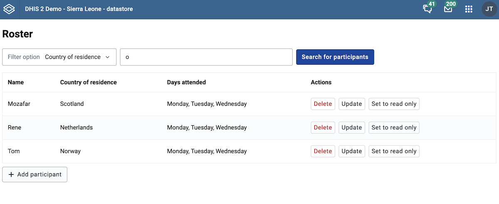

:::tip[What you will learn]
- [ ] DHIS2 Data stores
:::

## Agenda
| Time | Topic | |
| --- | --- | --- |
| 09:00 - 10:30 | Opening Workshop | Data Store |
| 10:30 - 11:00 | _coffee break_ | |
| 11:00 - 12:30 | Workshop | Data Store |
| 12:30 - 13:30 | _lunch break_ | |
| 13:30 - 15:00 | Workshop | Individual work |
| 15:00 - 15:30 | _coffee break_ | |
| 15:30 - 16:30 | Workshop | Individual work |
| 16:30 - 16:45 | Closing | |
| 16:45 - 17:00 | Q&A (with French support) | |

## Presentation
<iframe src="https://docs.google.com/presentation/d/e/2PACX-1vQLPboeTmPi_dpvfOcAE1LaiXmdjX-5-d6LKMjGssBgKlre8O0ZwDfr_Krf7DsMxXneeuVCdkn_NyVS/embed?start=false&loop=false&delayms=3000" frameborder="0" width="100%" height="569" allowfullscreen="true" mozallowfullscreen="true" webkitallowfullscreen="true"></iframe>


## Data Store Task Instructions

:::warning
For this task, we will use a separate branch `datastore-workshop` rather than _main_ as in the previous days. Commit all your local changes on your current branch before you start this checkout!
:::

To get started, make sure to set `upstream` to point to the original repository you forked:

```shell
git remote add upstream git@github.com:dhis2/academy-web-app-dev.git
```

then run

```
git fetch upstream
```

and then

```
git checkout datastore-workshop
```

finally, it is recommended, that you create your own working branch, e.g. using the following command but updating your name.

```
git checkout -b datastore-workshop-YOURNAME 
```

For for this task, always make sure you're always working on the correct branch (either `datastore-workshop` or your branch based off of that branch)

## Tasks overview

You are going to use the data store (`api/dataStore/academyParticipants`) to create and maintain a roster of the participants in our academy.



### Tasks approach

This assignment will ask you to apply many of the principles that you learned in Day 3 (app-runtime queries and mutations) and the morning of Day 4 (data store). The instructions provide fewer details than the previous days in order to allow you to apply your knowledge and use your creativity.

The skeleton code is as follows:
```
|- /src
|--- /hooks
|------ useUpdateSharing.js
|    # Navigation module
|--- /components
|------ AddUpdateModal.js
|------ AddUpdateModal.module.css
|------ StudentList.js
|------ StudentList.module.css
|------ StudentTable.js
|--- App.js
|--- App.test.js
|--- constants.js
```

Much of the UI has been provided for you and your goal is to add in various functionality.

:::tip[Data store IDs]
The namespace we are using is `academyParticipants`, but you should use the constant value defined in constants.js in case you want to change it later (Task 7)
:::


## Task 1 - Apply filter

:::info[Requirement]
The existing request to the data store has a hardcoded filter value, but it is not applied. Apply the filter.
:::

Look at the code in StudentList.js for the query for the data store. Modify it to apply the hardcoded filter (filter on `country` for values containing the letter `o`)

```
const DATASTORE_OVERVIEW = {
    dataStore: {
        resource: `dataStore/${DATASTORE_NAME}`,
        params: {
            fields: '.',
        },
    },
}
```

### Solutions

:::note[Solution]
Look at [this commit](https://github.com/dhis2/academy-web-app-dev/commit/040276a0eb5d6be725646e32c73b5731c389834a). The first task only requires that you implement the hardcoded filter that is preopulated.
:::

## Task 2 - Implement filter UI

:::info[Requirement]
The existing filter is hardcoded. Modify it to allow you to select the field to filter and allow you to pass the filter value of your choice.
:::

You will need to modify the component FilterSelection which is defined within the StudentList.js file. You will need to determine how to keep track of the user's filter selection and then pass them to the refetch which will relaunch the request to the data store.

You will also need to update the definition of the `DATASTORE_OVERVIEW` query. HINT: you might want to define the `params` as a function that depends on the variables you pass to `refetch` function.

For example:

```
params: (filterSelections) => filterSelections ? ({...paramsWithFilter}) : ({...paramsWithoutFilters})
```

### Solutions

:::note[Solution]
Look at [this commit](https://github.com/dhis2/academy-web-app-dev/commit/f566c343fbd4334014fec442b8e63ca7070e8a74). The implementation of a persisted filter relies on keeping the filter details in a state variable (filter); you can learn more about [useState in the react documentation](https://react.dev/reference/react/useState).
:::

## Task 3 - Create a mutation to add a new participant

:::info[Requirement]
Add a mutation that adds a new student to the data store.
:::

You will update the addParticipant in AddUpdateModal.js to use a mutation defined with `useDataMutation`. The mutation needs to create a new `key` for the existing name space. You can use the student name as the name for the `key`.

The format should be:

```
    {
        "name": "Xavi",
        "country": "Spain",
        "daysAttended": [
            "Monday",
            "Tuesday",
            "Wednesday"
            ]
    }
```

:::tip[daysAttended]
The daysAttended field is currently entered as a string in the modal. The data store expects an array. You can either convert the string to the array on mutation, or update the UI to use a multiselect.
:::


:::note[Bonus]
Handle success / errors with alerts defined using `useShowAlerts`
:::

### Solutions

:::note[Solution]
Look at [this commit](https://github.com/dhis2/academy-web-app-dev/commit/6fe12f92da68760c38420a75bb6e91e5594f5fce). Normally, for add mutations, we would use `type: 'create'`, but for the data store, it is possible (and easier in terms of how to write the query), to use update.
:::


## Task 4 - Create a mutation to delete a participant

:::info[Requirement]
Add a mutation that deletes participants from the data store.
:::

You need to create a deleteMutation in StudentList.js using useDataMutation.

:::note[Bonus]
Handle success / errors with alerts defined using `useShowAlerts`
:::

### Solutions

:::note[Solution]
Look at [this commit](https://github.com/dhis2/academy-web-app-dev/commit/70553a72b0287bc4490a48406095c0b7be5c66ec). The bonus task of showing alerts is not implemented, but the UX should be fairly clear in case of success as the participant will be removed from the results.
:::

## Task 5 - Create a mutation to update a participant

:::info[Requirement]
Add a mutation that updates participants from the data store.
:::

You will update the updaeParticipant in AddUpdateModal.js to use a mutation defined with `useDataMutation`. Make sure to handle values for `daysAttended` properly.

:::note[Bonus]
Handle success / errors with alerts defined using `useShowAlerts`
:::

### Solutions

:::note[Solution]
Look at [this commit](https://github.com/dhis2/academy-web-app-dev/commit/e43a2d4c4d846cfa3df7fcac1ef3905f033f860c). Since we used a mutation of `type:'update'`, we can reuse it for the update operation. Note that, the query id has been updated to be based on an existing participant key if one exists, so that a new participant will not be added if the name is modified.
:::

## Task 6 - Restrict sharing for participant

:::info[Requirement]
Restrict sharing of the data store object to be read only.
:::

You will need to define a mutation function that can be used to restrict sharing. This `sharingMutation` is currently defined (but does not do anything) in StudentList.js

It is recommended that you define a custom hook that handles this. Look at hooks/useUpdateSharing.js to see 

:::tip[engine]
You can use the engine defined by useDataEngine to sequentially execute DHIS2 queries (see https://dhis2.nu/docs/app-runtime/hooks/usedataengine/)
:::

:::tip[Data store IDs]
You need the data store ID to update the sharing. You can get this at `api/dataStore/{namespace}/{key}/metaData`
:::

:::tip[Sharing]
Look at the [sharing api](https://docs.dhis2.org/en/develop/using-the-api/dhis-core-version-240/sharing.html) to see how to update sharing. Public sharing needs to be changed from `rw------` to `r-------`
:::

### Solutions

:::note[Solution]
Look at [this commit](https://github.com/dhis2/academy-web-app-dev/commit/3d3143155f8d477d87de1ed76016f9e3b431a176).
:::


## Task 7 - Handle undefined data store endpoint

:::info[Requirement]
Handle cases where data store namespace is not defined.
:::

To build a generic app, you should handle cases where the namespace is not defined.

Change the definition of the namespace in constants.js (e.g. you can update to `academyParticipantsYOURNAME` (replace `YOURNAME`)). Now you have an undefined name space when using the app.

Your app should check (e.g. in App.js) if the namespace exists. If it does not exist, it should create the namespace, so that the user can proceed and add new users.

### Solutions

:::note[Solution]
Look at [this commit](https://github.com/dhis2/academy-web-app-dev/commit/2fba60308fba9bf92efaf30a0ed9252808e39b71). Note that you need to add a key to a datstore namespace when you create one. Here, Rene is added as the first participant upon the creation of the data store.
:::

## Task 8 - Implement feature toggling

:::info[Requirement]
Modify update modal to allow for partial updates (v41+)
:::

As of v41, you can now do partial updates (update a property within a key); see [data store partial updates documentation](https://docs.dhis2.org/en/develop/using-the-api/dhis-core-version-master/data-store.html#partial-update-experimental).

You can change the update UI to be different for v41+. For v41+, you can allow user to select an individual property, and then use a partial update mutation to modify the value (if there is a change).

### Solutions

:::note[Solution]
Look at [this commit](https://github.com/dhis2/academy-web-app-dev/commit/5f754fd98e5de5d472a8025506c3cd02264047b9). To illustrate the possibilities of feature toggling, this solution changes the implementation slightly to allow v41+ instances to only update days attended. You could implement this in different ways (e.g. implement patch updates for fields that have changed) depending on what you want to accomplish.
:::

## Resources

Some handy links:

-   [Data Store API Documentation](https://docs.dhis2.org/en/develop/using-the-api/dhis-core-version-240/data-store.html)
-   [User Data Store API Documentation](https://docs.dhis2.org/en/develop/using-the-api/dhis-core-version-240/data-store.html#webapi_user_data_store)
-   [Data Store Management App](https://academy.demos.dhis2.org/web-app/dhis-web-datastore/index.html#/)